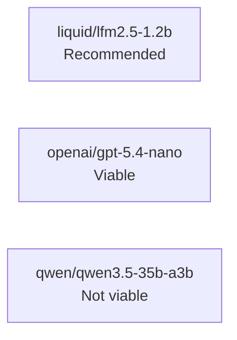
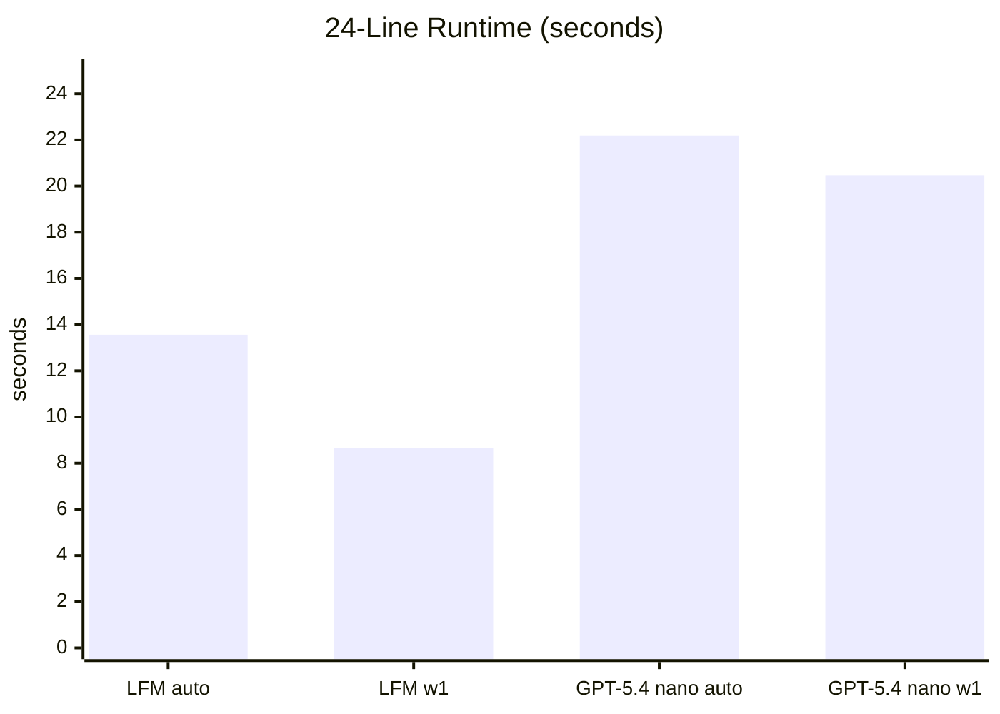
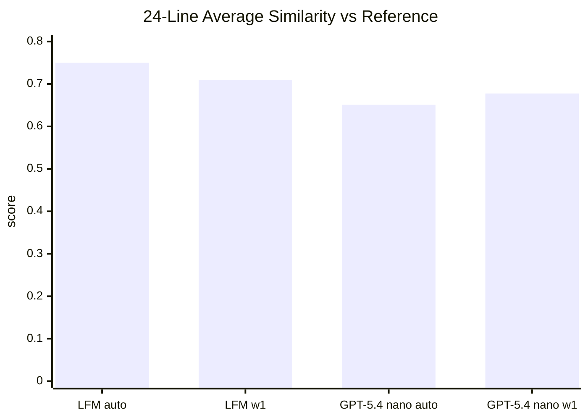

# Models Benchmark

## Status

| Model | Backend | Status | Why |
| --- | --- | --- | --- |
| `liquid/lfm2.5-1.2b` | LM Studio | Recommended | Fastest tested usable model and best 24-line reference match |
| `openai/gpt-5.4-nano` | OpenRouter | Viable | Correct output, but slower than LFM and weaker on the same slice |
| `qwen/qwen3.5-35b-a3b` | LM Studio | Not viable | Too slow for this workload and did not reliably return final subtitle text |



## Method

- Source subtitle: the German `Dampfnudelblues-2013--Deutsch-1080p-x265-HEVC.de.hi.srt` sample
- Reference subtitle: the paired Portuguese `Dampfnudelblues-2013--Deutsch-1080p-x265-HEVC.pt-BR.srt` sample
- Main comparison slice: first `24` subtitle events
- Larger stability slice for LFM: first `120` subtitle events
- Quality metric: simple line-by-line string similarity against the existing PT-BR subtitle

## Runtime

24-line slice, lower is better.



## Combined View

24-line slice, farther up and farther left is better.

```mermaid
quadrantChart
  title "Speed vs Quality"
  x-axis "Faster" --> "Slower"
  y-axis "Lower similarity" --> "Higher similarity"
  quadrant-1 "Slow but strong"
  quadrant-2 "Best zone"
  quadrant-3 "Weak"
  quadrant-4 "Slow and weak"
  "LFM auto (13.56s, 0.7499)": [0.27, 0.94]
  "LFM w1 (8.66s, 0.7099)": [0.00, 0.81]
  "GPT-5.4 nano auto (22.19s, 0.6510)": [1.00, 0.56]
  "GPT-5.4 nano w1 (20.47s, 0.6776)": [0.86, 0.67]
```

## Quality

24-line slice, higher is better.



## Results

| Model | Case | Time | Retries | Downshifts | Non-empty lines | Avg similarity |
| --- | --- | ---: | ---: | ---: | ---: | ---: |
| `liquid/lfm2.5-1.2b` | 24 lines, auto | `13.56s` | `7` | `0` | `24/24` | `0.7499` |
| `liquid/lfm2.5-1.2b` | 24 lines, `window-size 1` | `8.66s` | `0` | `0` | `24/24` | `0.7099` |
| `liquid/lfm2.5-1.2b` | 120 lines, auto | `40.29s` | `35` | `4` | `120/120` | `0.6589` |
| `openai/gpt-5.4-nano` | 24 lines, auto | `22.19s` | `12` | `1` | `24/24` | `0.6510` |
| `openai/gpt-5.4-nano` | 24 lines, `window-size 1` | `20.47s` | `0` | `0` | `24/24` | `0.6776` |

## Qwen Notes

- `qwen/qwen3.5-35b-a3b` did not produce a competitive result for subtitle translation on the tested LM Studio setup.
- Auto-window runs stalled early on marker round-tripping.
- Single-line runs were much slower than LFM or GPT-5.4 nano.
- The LM Studio OpenAI-compatible path often returned long reasoning output without a reliable final subtitle answer.

## Recommendation

For the current tested setup:

- Use `liquid/lfm2.5-1.2b` as the default subtitle model.
- If you want a hosted option, `openai/gpt-5.4-nano` is acceptable but slower.
- Do not recommend `qwen/qwen3.5-35b-a3b` for this workflow.
